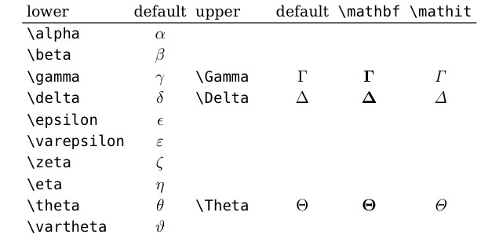
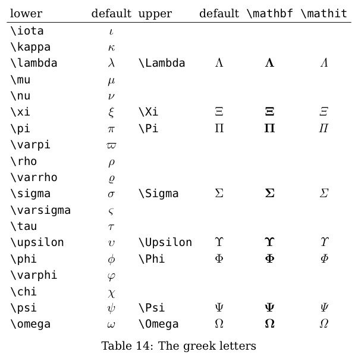

# Markdown foundation

## 目录

[toc]

## Matrix and The groups

* Matrix

$$
\begin{Bmatrix}
1&2&3\\
2&3&4\\
3&4&5
\end{Bmatrix}
$$

* Det

$$
\begin{vmatrix}
1&2&3\\
2&3&4\\
3&4&5
\end{vmatrix}
$$

* non continuation

  $$
  f(x)=
  \begin{cases}
  1,\,\,x\le0\\
  2,\,\,x>0
  \end{cases}
  $$
* 左对齐

$$
\begin{aligned}
x^2 + 6x + 8 &= (x+3)^2-9+8 \\
 &= (x+3)^2-1 \\
 &= (x+4)(x+2)
\end{aligned}
$$

https://zhuanlan.zhihu.com/p/654756146

空格： [怎么在LaTeX,Markdown和知乎上写数学公式时打出空格 - 知乎 (zhihu.com)](https://zhuanlan.zhihu.com/p/265517357)

[markdown编辑数学公式_markdown无穷-CSDN博客](https://blog.csdn.net/huanhuan_Coder/article/details/79325071)

[史上最全Markdown公式、符号总结！！！-CSDN博客](https://blog.csdn.net/weixin_42782150/article/details/104878759)

## Greek letter





* $\mathscr{E}$ script E

## General paragraph

* Fold the formula

<details>
<summary> 折叠公式</summary><br>
$$
E=mc^2
$$
</details>

General operation

* \quad 空格
* \pm 加减
* $\sim$ 相似
* $\equiv$ 恒等
* $\hat x$ 基矢符号
* $U^\dagger$ Hermite operator
* $\bar{a}$
* $\overline{ABC}$
* $\underline{ABC}$
* $\tilde{A}$
* $\langle \psi | \phi \rangle$
* 或者 $\bra{\psi}\ket{\varphi}$, 但这个html不支持.
* **&#8194** 空格
* $\because \therefore$
* $\propto$
* $\otimes$
* $\times$
* $\dot{x}$ 
* $\mathbf{A}$ 矢量加粗

## font form

### Comprehensive

<span style="color: red; font-family: 'Comic Sans MS'; font-size: 20px;"> This is a paragraph with red text, Comic Sans MS font, and a font size of 20px. </span>

### Color

<span style="color:blue;"> Blue </span>

<div style="color: Blue;">
这是一个蓝色的段落。<br>
你可以在这里写更多的内容，所有的文字都会是蓝色的。
</div>
### 下滑线

<u>下划线</u>

### 居中

<p align="center">图 2.2</p>

### type

必须输出html或PDF可见

* 局部

```html
<!DOCTYPE html>
<html lang="zh-CN">
<head>
    <meta charset="UTF-8">
    <title>使用自定义字体的Markdown示例</title>
    <style>
        @font-face {
            font-family: 'Hanyijie';
            src: url('file:///home/Hanyijie/Nutstore Files/我的坚果云/tool/font/韩懿杰.ttf') format('truetype');
        }
        .custom-font {
            font-family: 'Hanyijie', sans-serif;
        }
    </style>
</head>
<body>
    <h1 class="custom-font">这是一个使用自定义字体的标题</h1>
    <p class="custom-font">这是一个使用自定义字体的段落。</p>
</body>
</html>
```

* 全局

```html
<!DOCTYPE html>
<html lang="zh-CN">
<head>
    <meta charset="UTF-8">
    <title>使用自定义字体的Markdown示例</title>
    <style>
        @font-face {
            font-family: 'Hanyijie';
            src: url('file:///home/Hanyijie/Nutstore Files/我的坚果云/tool/font/韩懿杰.ttf') format('truetype');
        }
        body {
            font-family: 'Hanyijie', sans-serif;
        }
    </style>
</head>
<body>
  
<!-- 从这里开始是Markdown内容 -->
  
# 这是一个使用自定义字体的标题

这是一个使用自定义字体的段落。

## 这是第二级标题

另一个段落，用自定义字体展示。

<!-- 到这里结束Markdown内容 -->

</body>
</html>
```

* .ipynb 文件local

```html
<style>
    @font-face {
        font-family: 'Hanyijie';
        src: url('file:///home/Hanyijie/Nutstore Files/我的坚果云/tool/font/韩懿杰.ttf') format('truetype');
    }
    .custom-font {
        font-family: 'Hanyijie', sans-serif;
        font-size: 20px; /* 调整这里的值来改变字体大小 */
    }
</style>

<div class="custom-font">
  
# 这是一个使用自定义字体的标题

这是一个使用自定义字体的段落。

## 这是第二级标题

另一个段落，用自定义字体展示。

</div>
```

## 图像

* 直接导入

1. 本地
   同文件夹（或者在这个文件夹里的文件夹里的文件也可以）
   

上一个文件夹

2. 网络


* 控制大小

表格里不可以用。


