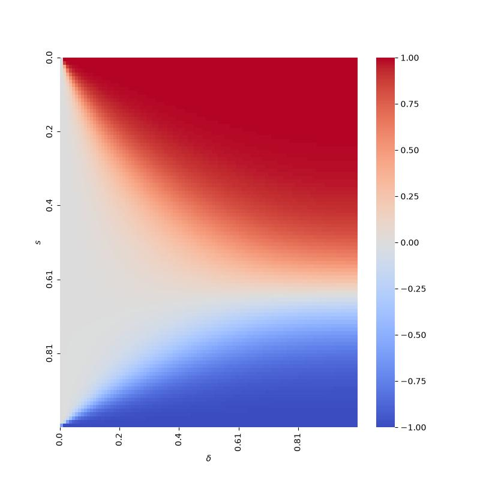
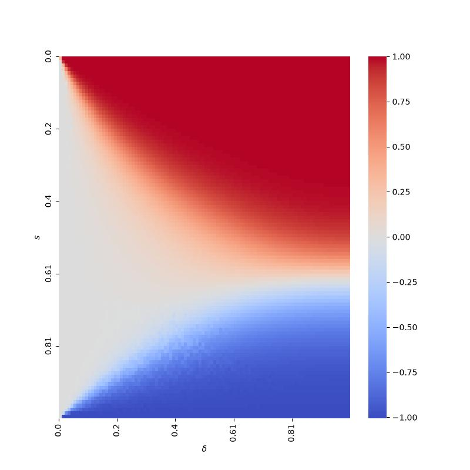
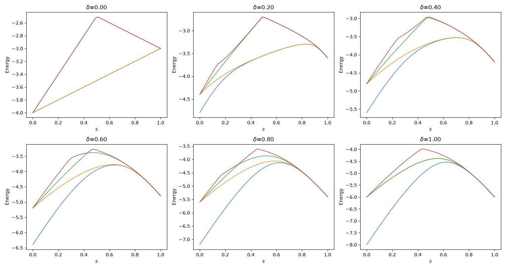
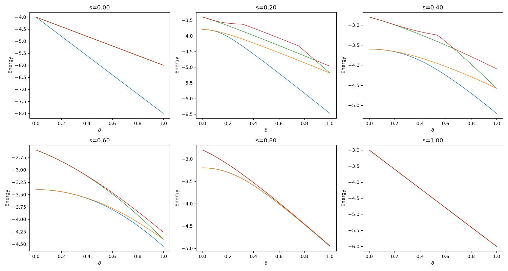
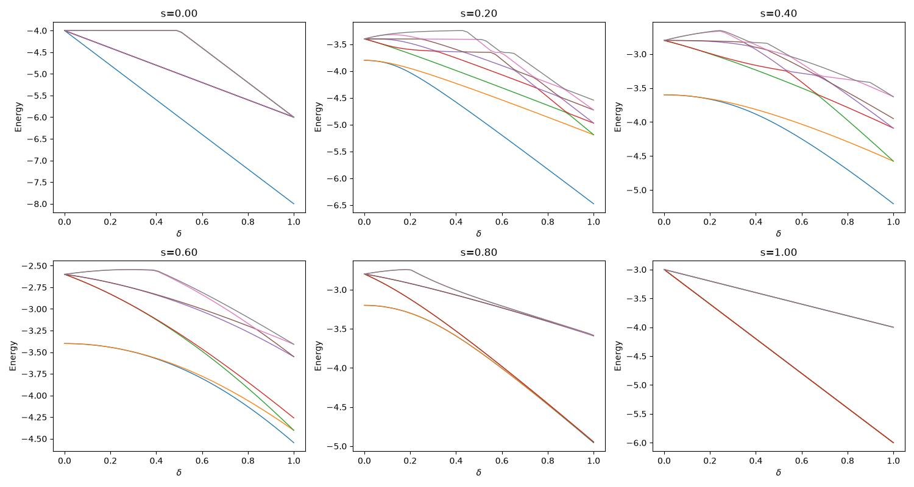
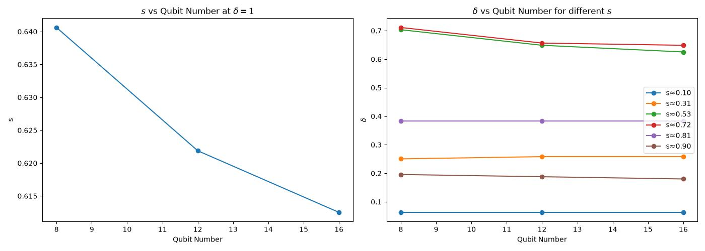
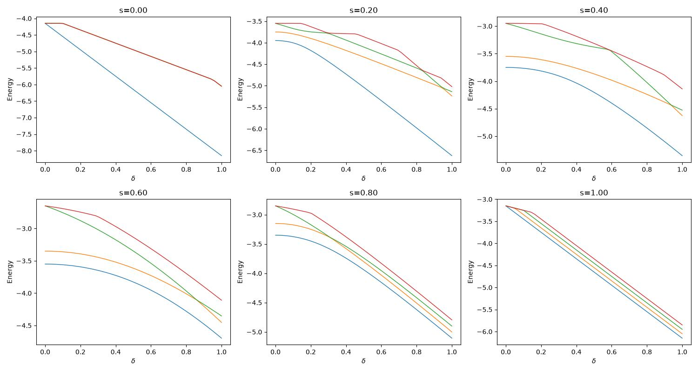
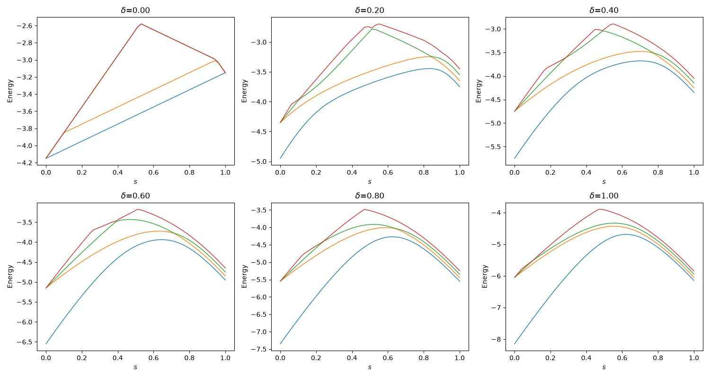
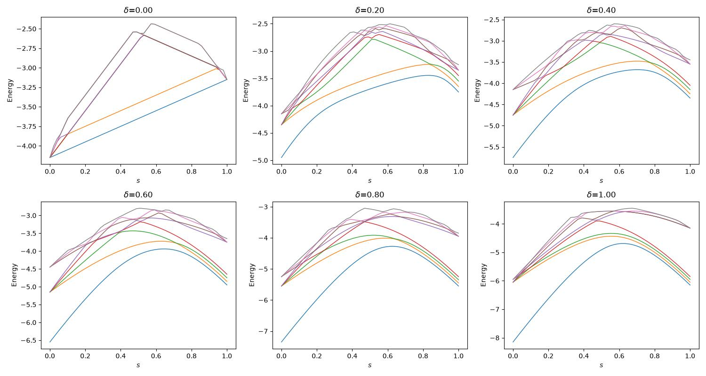

# SSH 模型变分参数演化 — 知识总结

---

## 1. 项目概览

本项目围绕 SSH（Su-Schrieffer-Heeger）模型，建立一套完整的数值实验与变分量子计算方案，通过拓扑序参量 $Z_R$（反射算符期望值）对基态进行三分类（相 1: $Z_R=1$，相 2: $Z_R=-1$，相 3: $Z_R=0$），并利用对称性约束打开基态简并，最终设计变分量子电路实现任意参数点的基态制备与拓扑分类。

**四个阶段：**

| 阶段 | 状态 |
| --- | --- |
| 1. 数值相图绘制与相边界计算 | 已完成 |
| 2. 对称性分析：简并打开、初态选择、约束 H 验证 | 已完成 |
| 3. 变分方案设计与文档 | 已完成 |
| 4. 变分参数演化代码实现与实验 | 进行中 |

**技术栈**：Julia（QuantumToolbox.jl 数值计算）+ Python（PyPlot/Seaborn 可视化）+ Qiskit（量子电路模拟）

---

## 2. SSH 模型

### 2.1 哈密顿量

SSH 哈密顿量具有交替耦合结构：

$$
H = (1-s) \sum_{i\ \text{odd}} (X_i X_{i+1} + \delta Z_i Z_{i+1}) + s \sum_{j\ \text{even}} (X_j X_{j+1} + \delta Z_j Z_{j+1})
$$

- **耦合参数**：$J_1 = 1-s$（奇偶对）、$J_2 = s$（偶奇对）
- **各向异性参数**：$\delta$
- 参数空间：$(s, \delta) \in [0,1] \times [0,1]$

**约束条件**：比特总数 $N$ 必须是 4 的倍数（$4N^+$），最少为 8。这限制了演化初态旋转和基态对称性。

## 3. $Z_R$ 序参量

### 3.1 物理意义

$Z_R$ 是用于量化空间反演对称性的拓扑序参量。反射算符 $S$ 将链关于中心做镜面反射：

$$
S = \bigotimes_{i=1}^{N/2} \mathrm{SWAP}_{i,\ N-i+1}
$$

### 3.2 计算公式

$$
Z_R = \frac{\mathrm{tr}(\rho S)}{\sqrt{(\mathrm{tr}(\rho_1^2) + \mathrm{tr}(\rho_2^2))/2}}
$$

其中：

- $\rho_1 = \mathrm{ptrace}(\rho, \text{后半部分})$，$\rho_2 = \mathrm{ptrace}(\rho, \text{前半部分})$ —— 将系统等分为前后两半
- 分子是反射算符的期望值
- 分母是半链纯度的 RMS，起到归一化作用

### 3.3 实际计算的截断

对 8+ 比特系统，为去除边缘自由比特的简并影响，先对边缘 4 个比特求偏迹，保留中间子系统后再计算 $Z_R$：

```julia
sub_num = qubit_num - 4
sub_system = ntuple(i -> i + 2, sub_num)
_, ψ0 = get_ssh_group_state(qubit_num, s, δ)
sub_ρ = ptrace(ψ0, sub_system)
ZR_val = get_ZR_val(sub_ρ)
```

### 3.4 $Z_R$ 值的含义

| $Z_R$ 值 | 拓扑相 | 典型参数区域 |
| --- | --- | --- |
| $+1$ | （平凡） | $s=0$（$J_1$ 主导） |
| $-1$ | （非平凡） | $s=1$（$J_2$ 主导） |
| $0$ | （临界） | $\delta = 0$ 区域 |

---

## 4. 数值相图

### 4.1 相图热力图





观察：

- 左侧区域（$s$ 小）：$Z_R = +1$（蓝色）
- 右侧区域（$s$ 大）：$Z_R = -1$（红色）
- 相边界为一曲线，边界附近 $Z_R$ 在 0 附近连续过渡（白色）
- 当 $\delta \to 0$ 时：整个 $(0,1)$ 区间 $Z_R \to 0$（$XX$ 模型临界特性）
- $N$ 增大时相边界附近过渡更陡峭

### 4.2 能谱

#### δ 切片

- N = 8, k(绘制最低能级数量) = 4



- N = 8, k = 8


#### s 切片

- N = 8, k = 4



- N = 8, k = 8



- 低能区存在基态简并（不同扫描方向可见）
- 简并度与相区有关

### 4.3 相边界计算

采用两步法：

1. **固定 $\delta=1$**：求 $Z_R=0$ 的临界 $s$ 值 $s_p$（使用 `Roots.jl` 的 bracketing 方法）
2. **以 $s_p$ 分段**：在 $s < s_p$ 和 $s > s_p$ 两个区间，分别固定若干 $s$ 值，求 $Z_R = \pm 0.5$ 的 $\delta$ 临界值

分段原因：$s_p$ 是 $Z_R$ 符号变化的分界点，两侧搜索不同的目标值（0.5 和 -0.5）。



结果显示相边界随比特数增大趋近于某个极限位置。

---

## 5. 对称性分析

### 5.1 为什么需要对称性分析

核心问题：**SSH 模型的基态在参数空间部分区域存在多重简并（4 重），无法直接标记出目标基态。**

我们需要找到一个方法，使得演化初态和目标态有**确定的对称性标记**，从而保证绝热演化过程中对称性可以保护演化路径（防止简并能级间的跃迁）。

### 5.2 寻找对称性算符

我们寻找与 $H(t)$ 恒对易的算符：

$$
[P, H(t)] = 0
$$

由 Pauli 基构成的酉算符 $U$ 满足 $U^2 = I$，自然具有两个本征值 $\pm 1$。为获得四个本征值以区分四个简并态，将两个对易厄米 $U$ 线性组合：

$$
P = U_1 + 2U_2
$$

此时 $P$ 的本征值为 $\{3, -1, 1, -3\}$（通过 $U_1, U_2$ 的 $\pm 1$ 组合得到, 切从s=1非简并基态可以看出基态对称性为P=3）。

对于 SSH 模型的 XX + ZZ 形式，至少三个候选：

$$
\begin{cases}
U_x = \bigotimes_{i=1}^N X_i\\
U_y = \bigotimes_{i=1}^N Y_i\\
U_z = \bigotimes_{i=1}^N Z_i\\
\end{cases}
$$

验证：

- $[U_i, H(t)] = 0$ —— 与哈密顿量对易
- $[U_i, U_j] = 0$ —— 相互对易

但 $U_y$ 冗余，因为 $(-i)^N U_y = U_x U_z$。最终选择：

$$
\begin{cases}
U_x = \bigotimes_{i=1}^N X_i\\
U_z = \bigotimes_{i=1}^N Z_i\\
\end{cases},
\quad
P = U_x + 2U_z
$$

**约束：$N$ 必须为4的倍数。**

### 5.3 对称性约束哈密顿量

在原 SSH 哈密顿量基础上加入对称性惩罚项：

$$
H_c = H_{\text{SSH}} - \epsilon P = H_{\text{SSH}} - \epsilon (U_x + 2U_z)
$$

效应：

- 不同对称性的简并能级发生分裂
- 目标对称性 $\langle P \rangle = 3$ 的基态能量下降 $3\epsilon$，与其他态分离开
- $\epsilon$ 取 0.05 小量即可，过大会导致高对称性能级降到更低

### 5.4 对称性约束哈密顿量的验证实验

#### ZR 相图对比

| 无约束 | 有约束 |
|---|---|
|  |  |

**结论**：ZR 相图无变化，说明约束 $H_c$ 并未改变基态本身，只产生了能级分裂。

#### 能谱对比

**$k=4$ 最低能级（s 扫描）：**

| 无约束 | 有约束 |
|---|---|
|  |  |

**$k=4$ 最低能级（$\delta$ 扫描）：**

| 无约束 | 有约束 |
|---|---|
|  |  |

**$k=8$ 最低能级（s 扫描）：**

| 无约束 | 有约束 |
|---|---|
|  |  |

**$k=8$ 最低能级（$\delta$ 扫描）：**

| 无约束 | 有约束 |
|---|---|
|  |  |

**结论**：加入对称性约束后，原本的简并能级发生了清晰的分裂，在不改变基态的同时，简并被打开，目标对称性的基态被孤立出来。

## 6. 初态选择与电路制备

### 6.1 总原则

初始态的首要目标是**方便制备**，其次是不简并，再不然是可以从简并空间中挑出目标态。

### 6.2 三个相的初态分析

#### 相 -1（$Z_R = -1$）

**参数选择**：$s=1$, $\delta \neq 0$

$$
\min \sum_{i\ \text{even}} X_i X_{i+1} + \delta Z_i Z_{i+1}
$$

由于所有项对易，基态每个偶奇对有 $X_iX_{i+1} = Z_iZ_{i+1} = -1$。

**简并性**：当 $N = 4N^+$ 时，全局守恒量：
$$
U_x = U_z = 1
$$
必然导致边界 $X_1 X_N = -1$, $Z_1 Z_N = -1$。守恒量约束退化成了边界条件的约束。边缘态也是最低能量 Bell state。

以四比特为例, 对易关系全貌：

$$
[XXXX, ZZZZ, XIIX, IXXI, ZIIZ, IZZI, H(0)] = 0
$$

两组冗余标记：
$$
\begin{cases}
[U_x, U_z, H(0)] = [XXXX, ZZZZ, H(0)] \quad\text{（全局）}\\
[XIIX, ZIIZ, H(0)] \quad\text{（边界）}\\
[IXXI, IZZI, H(0)] \quad\text{（内部，}t=0\text{ 时完全简并）}
\end{cases}
$$

前两组对易力学量都足以从四重简并空间中标记出目标对称性基态。

**量子态**：环链的 Bell pair product：$(\ket{01} - \ket{10})^{\otimes N/2}$（每对 base 门 + 首尾环闭合）：

**8比特完整电路示例**（注意首尾比特 0 和 7 通过 Hadamard + CNOT 闭合为环）：

```text
     ┌───┐┌───┐          
q_0: ┤ X ├┤ H ├───────■──
     ├───┤├───┤       │  
q_1: ┤ X ├┤ H ├──■────┼──
     ├───┤└───┘┌─┴─┐  │  
q_2: ┤ X ├─────┤ X ├──┼──
     ├───┤┌───┐└───┘  │  
q_3: ┤ X ├┤ H ├──■────┼──
     ├───┤└───┘┌─┴─┐  │  
q_4: ┤ X ├─────┤ X ├──┼──
     ├───┤┌───┐└───┘  │  
q_5: ┤ X ├┤ H ├──■────┼──
     ├───┤└───┘┌─┴─┐  │  
q_6: ┤ X ├─────┤ X ├──┼──
     ├───┤     └───┘┌─┴─┐
q_7: ┤ X ├──────────┤ X ├
     └───┘          └───┘
```

#### 相 1（$Z_R = +1$）

**参数选择**：$s=0$, $\delta \neq 0$

$$
\min \sum_{i\ \text{odd}} X_i X_{i+1} + \delta Z_i Z_{i+1}
$$

同理，所有奇偶对 $X_iX_{i+1} = Z_iZ_{i+1} = -1$，且没有边缘简并。

**对称性**：非简并基态有 $U_x = U_z = 1$。

**电路制备**：同相 -1 的 Bell pair 结构，但耦合边从边界开始（比特 (1,2), (3,4)...），无环闭合。

**8比特完整电路**：

```text
     ┌───┐┌───┐     
q_0: ┤ X ├┤ H ├──■──
     ├───┤└───┘┌─┴─┐
q_1: ┤ X ├─────┤ X ├
     ├───┤┌───┐└───┘
q_2: ┤ X ├┤ H ├──■──
     ├───┤└───┘┌─┴─┐
q_3: ┤ X ├─────┤ X ├
     ├───┤┌───┐└───┘
q_4: ┤ X ├┤ H ├──■──
     ├───┤└───┘┌─┴─┐
q_5: ┤ X ├─────┤ X ├
     ├───┤┌───┐└───┘
q_6: ┤ X ├┤ H ├──■──
     ├───┤└───┘┌─┴─┐
q_7: ┤ X ├─────┤ X ├
     └───┘     └───┘
```

#### 相 0（$Z_R = 0$）

**参数选择**：$\delta = 0$, $s \neq 0,1$（$XX$ 模型）

$$
H = (1-s)\sum_{i\ \text{odd}} X_i X_{i+1} + s\sum_{j\ \text{even}} X_j X_{j+1}
$$

所有项相互对易，基态 $X_iX_{i+1} = -1$ 对所有 $i \in [1, N-1]$。**二重简并**。

简并空间：
$$
\ket{\phi^+} = \ket{+-+-...},\quad \ket{\phi^-} = \ket{-+-+...}
$$

$U_x$ 不区分这两个态（本征值同为 1）。但 $U_z$ 在简并子空间内的矩阵为：
$$
U_z^{\phi^\pm} = \begin{pmatrix} 0 & 1 \\ 1 & 0 \end{pmatrix}
$$

对角化得 $\ket{\psi^\pm} = \frac{1}{\sqrt{2}}(\ket{\phi^+} \pm \ket{\phi^-})$，$U_z = \pm 1$。

对于目标对称性 $P = U_x + 2U_z$，选用 $U_z=1$ 的本征态：
$$
\frac{1}{\sqrt{2}}(\ket{\phi^+} + \ket{\phi^-})
$$

**这是一个 X 表象下的 GHZ 态。**

**8比特完整电路**（$|\phi^+\rangle + |\phi^-\rangle$，即 X 表象 GHZ）：

```text
     ┌───┐     ┌───┐┌───┐                              
q_0: ┤ H ├──■──┤ X ├┤ H ├──────────────────────────────
     └───┘┌─┴─┐└───┘├───┤                              
q_1: ─────┤ X ├──■──┤ H ├──────────────────────────────
          └───┘┌─┴─┐└───┘┌───┐┌───┐                    
q_2: ──────────┤ X ├──■──┤ X ├┤ H ├────────────────────
               └───┘┌─┴─┐└───┘├───┤                    
q_3: ───────────────┤ X ├──■──┤ H ├────────────────────
                    └───┘┌─┴─┐└───┘┌───┐┌───┐          
q_4: ────────────────────┤ X ├──■──┤ X ├┤ H ├──────────
                         └───┘┌─┴─┐└───┘├───┤          
q_5: ─────────────────────────┤ X ├──■──┤ H ├──────────
                              └───┘┌─┴─┐└───┘┌───┐┌───┐
q_6: ──────────────────────────────┤ X ├──■──┤ X ├┤ H ├
                                   └───┘┌─┴─┐├───┤└───┘
q_7: ───────────────────────────────────┤ X ├┤ H ├─────
                                        └───┘└───┘     
```

### 6.3 初态制备的 Qiskit 实现

```python
def get_initial_state(N, phase_idx=1):
    qc = QuantumCircuit(N, N)
    if phase_idx == 1:          # ZR = +1, s=0
        for i in range(0, N, 1):
            qc.x(i)
        for i in range(0, N, 2):
            qc.h(i)
        for i in range(0, N - 1, 2):
            qc.cx(i, i + 1)
    elif phase_idx == -1:       # ZR = -1, s=1
        for i in range(0, N, 1):
            qc.x(i)
        for i in range(1, N - 1, 2):
            qc.h(i)
        for i in range(1, N - 2, 2):
            qc.cx(i, i + 1)
        qc.h(0)
        qc.cx(0, N - 1)         # 环闭合：首尾连接
    elif phase_idx == 0:        # ZR = 0, δ=0
        qc.h([0])
        qc.cx([i for i in range(N - 1)], [i for i in range(1, N)])
        qc.x([2 * i for i in range(N // 2)])
        qc.h([i for i in range(N)])
    else:
        raise ValueError("The value of phase_idx must be 1, -1, 0.")
    return qc
```

---

## 7. 变分量子计算方案

### 7.1 核心思路

#### 关键观察

在 NISQ 时代处理拓扑分类问题，以下几个关键观察决定了方案的整体方向：

1. **无需测量保真度**：判断模拟机和量子计算机上的态是否相同，不必测量保真度。事实上只需该态在 $H_c$（哈密顿量 + 对称性惩罚）下的期望取最小即可。本质原因在于**能量和对称性都满足要求的态，就是目标基态**（在非简并区域唯一、在简并区域通过 $\epsilon$ 分裂后也唯一）。因此代价函数可以直接用 $H_c$ 的期望值，无需引入需要经典模拟的 fidelity 基准。

2. **不能只在三个特殊点学习**：如果只在 $(s=0,\delta=1)$、$(s=1,\delta=1)$、$(s=0.5,\delta=0)$ 三个点附近计算 ZR 后做机器学习，本质上是没有获得任何中间信息的 —— 拓扑分类的核心挑战恰恰是**相边界附近的连续过渡区域**，而这三点都远离边界。用三个远离边界的点去预测边界行为，信息量严重不足，没有机器学习可以发挥的空间。

3. **经典拟合不是量子机器学习**：退一步，即便把整个相图的离散网格点 ZR 计算结果当作训练数据做经典拟合（如插值或分类器），这和量子计算机的优势完全无关 —— 只是对数值模拟结果的经典后处理。更进一步，**如果已经有能力直接在经典计算机上计算相图中任意离散点的 ZR，那根本不需要量子计算机介入**。量子计算的价值必须体现在经典难以完成的任务上（如大系统基态制备）。

4. **ZR 三分类替代精确值**：由于 NISQ 量子计算机的测量误差和噪声，直接测量的 ZR 数值可信度极低。应当放弃对精确数值的追求，转而关注**分类结果**（ZR ≈ +1 / -1 / 0 三分类）。此时 classical shadow 等纠错方法的收益有限 —— 因为 shadow tomography 主要降低统计噪声而不改变测量结果的相对大小；如果直接测量已经无法区分 ±1，shadow 也很难救回。若后续需要精确估计更多算符期望值，classical shadow 仍有其价值。

#### 策略：穷举起点 + 路径优化 + 平均判别

对于相图中任一点 $(s,\delta)$：

1. **穷举三个相的起点**，对每个起点到目标点的路径进行变分优化
2. **对比每个相分区的优化结果**，取**同相起点组的平均代价**
3. 代价最低的起点组判为目标的真实拓扑相

当然，如果我们可以忍受指数次测量，也可以直接用上面所有线路的最优解作为计算ZR的态. 此时不必在乎 $ZR$ 到底是不是严格接近 $±1$, 因为我们已经没有更优的线路了. 因此只要可以把不同目标点的ZR结果分类成三种就可以了.

**我们也可以将二者结合**, 将起点ZR和目标点ZR的距离作为惩罚项，做整体优化.

> **注意：三个相出发线上的初态是完全相同的量子态。**, 同相起点只是演化起点不同，实际初态是相同的。

### 7.2 代价函数

$$
\begin{aligned}
H_c &= (1-s)\sum_{i\ \text{odd}} (X_i X_{i+1} + \delta Z_i Z_{i+1}) + s\sum_{j\ \text{even}} (X_j X_{j+1} + \delta Z_j Z_{j+1}) \\
&-\frac{\epsilon_1}{3}(U_x + 2U_z)  \quad \text{—— 对称性约束（此时 }\epsilon_1\text{ 不必取小量）}\\
&+ \epsilon_2|zr - ZR_p|^2  \quad \text{—— 终点 ZR 与起点相 }ZR_p\text{ 的距离惩罚}\\
&- \frac{\epsilon_3}{\tau} \cdot T  \quad \text{—— 演化时间惩罚（倾向短时间）}
\end{aligned}
$$

**参数说明**：

- $\epsilon_1$ 权衡对称性与能量
- $\epsilon_2$ 反映对 ZR 测量结果的信任程度
- $\epsilon_3$ 限制演化时间，与经典模拟时间 $\tau$ 成反比（量子计算机的误差在某种程度上自动施加此约束）

### 7.3 演化路径参数化：Bézier 曲线

#### 为什么用 Bézier

最优演化路径不一定是直线，甚至对于复杂相不一定始终靠近目标点。但如果自由度全部放开，优化难度太大。**假设最优路线是始终靠近目标点的光滑曲线**（没有拐点，曲率不变号）。

#### 二次 Bézier 曲线

从 $(s_0, \delta_0)$ 到 $(s_1, \delta_1)$：

$$
\begin{aligned}
s(t') &= (1-t')^2 s_0 + 2t'(1-t') s_c + t'^2 s_1 \\
\delta(t') &= (1-t')^2 \delta_0 + 2t'(1-t') \delta_c + t'^2 \delta_1
\end{aligned}
$$

其中 $t' = t/T \in [0,1]$。

**控制点** $(s_c, \delta_c)$ 的几何意义：起点切线与终点切线的交点。

参数空间限制：$s_c \in [s_0, s_1]$, $\delta_c \in [\delta_0, \delta_1]$（保证不回头）。


### 7.4 变分参数

| 参数 | 含义 | 范围 |
| --- | --- | --- |
| $s_c, \delta_c$ | 二次 Bézier 控制点 | $[s_0,s_1] \times [\delta_0,\delta_1]$ |
| $\Delta t_i$ | 各离散步的演化时间 | $\sum \Delta t_i = T$ |
| 步数 | 离散段数量 | 可省略极小步对应门 |
| $T$ | 总演化时间 | 无约束 |
| Trotter 阶数 | 分解精度 | 视效果而定 |

### 7.5 电路实现

**核心问题**：Qiskit 的 `QAOAAnsatz` 本质上只支持哈密顿量取两个值（$H(0)$ 和 $H_{\text{end}}$），演化路径不被天然支持。

**方案**：直接用 `PauliEvolutionGate`，手动将**演化路径**和**演化步长**（在真实量子计算机上还需考虑步数和分解阶数）作为变分参量，绑定哈密顿量各项的演化步长。

### 7.6 方法优势

1. 仅在 ZR 三分类的意义下，纠错不是必须的
2. 增加比特数不直接增加电路深度
3. $H_c$ 测量 settings 数量恒为 2（只需测量 XX 和 ZZ 两种 Pauli 基），理论上可充分发挥量子计算机优势
4. 如需精确估计更多算符期望值，可引入 classical shadow 等纠错方案

---

## 8. 项目文件结构

```
variational_param_evolution/
├── README.md                       # 项目总览
├── Project.toml / Manifest.toml    # Julia 依赖管理
│
├── phase_diagram/                  # 相图计算与绘制
│   ├── README.md
│   ├── get_ssh_ZR.jl               # 计算单点 ZR（含截断）
│   ├── get_ssh_phase.jl            # 扫描参数空间保存 npz
│   ├── get_ssh_spectrum.jl         # 计算能谱
│   ├── get_phase_boundary.jl       # 搜索相边界（Roots.jl）
│   ├── plot_ssh_phase.py           # 热力图可视化
│   ├── plot_phase_boundary.py      # 相边界可视化
│   ├── data/                       # npz 数据
│   └── pics/                       # 图像输出
│
├── symmetry_analysis/              # 对称性分析与约束哈密顿量验证
│   ├── README.md
│   ├── get_ssh_ZR.jl               # 约束 H 下的 ZR 计算
│   ├── get_ssh_phase.jl            # 约束 H 下的相图扫描
│   ├── get_ssh_spectrum.jl         # 约束 H 下的能谱扫描
│   ├── plot_ssh_phase.py           # 约束相图可视化
│   ├── plot_spectrum.py            # 能谱对比可视化
│   ├── data/ / pics/
│
├── variational_qc/                 # 变分量子计算方案
│   ├── README.md                   # 方案总览与设计文档
│   └── get_initial_state.py        # 三个相初态的 Qiskit 电路
│
├── concept/                        # 概念文档
│   ├── bezier_curve.md             # Bézier 曲线原理
│   ├── bezier_demo.py              # Bézier 曲线可视化
│   └── pics/
│
├── src/                            # 核心源代码
│   ├── create_op.jl                # SSH H、约束 H、SWAP、反射算符
│   ├── get_expect_instance.jl      # ZR 值计算
│   ├── get_spectrum.jl             # 通用能谱计算
│   └── var_param_evolution.jl      # 模块入口
│
└── test/
    └── test_expect_instance.jl     # ZR 值单元测试
```

---

## 9. 变分演化的下一步（待实现）

1. **代价函数在 Qiskit 上的实现**：将四项代价转化为可测量期望
2. **Bézier 路径的 PauliEvolutionGate 绑定**：离散路径上每步哈密顿量的 Trotter 分解与演化
3. **经典优化器对接**：将变分参数（控制点、步长、步数）输入 SPSA / COBYLA 等优化器
4. **三起点穷举流程**：对于每个目标参数点，从三个相起点分别优化，取最优组
5. **噪声模型测试**：在模拟噪声环境下验证 ZR 三分类的鲁棒性

---

## 10. 关键理论总结

### 对称性标记方案的逻辑链

1. SSH 模型有 4 重基态简并区域 → 需要标记
2. 找到全局守恒量 $U_x, U_z$ → 与 $H(t)$ 对易
3. 构造 $P = U_x + 2U_z$ → 四个分立本征值
4. 加微扰 $H_c = H - \epsilon P$ → 简并能级分裂
5. 选择 $\langle P \rangle = 3$ 的态 → 对应非简并基态的对称性
6. 对称性在演化中守恒 → 禁止简并能级间跃迁

### 变分拓扑分类的逻辑链

1. 每个拓扑相的基态有相同的全局对称性标记
2. 从同一相出发的演化路径代价天然更优
3. 穷举三个起点 → 对比优化结果 → 最低代价组 = 目标相
4. 省去精确 ZR 测量 → 只需三分类 → 容噪性强
5. Bézier 路径参数化 → 变分自由度可控 → 接近最优路径
