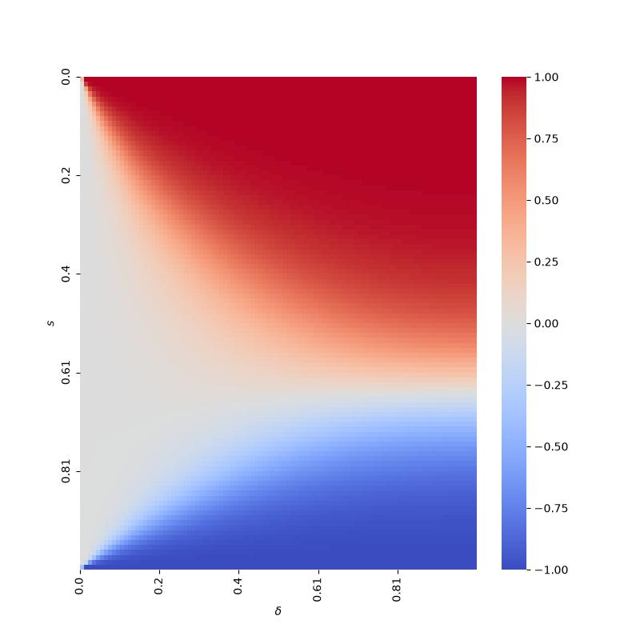
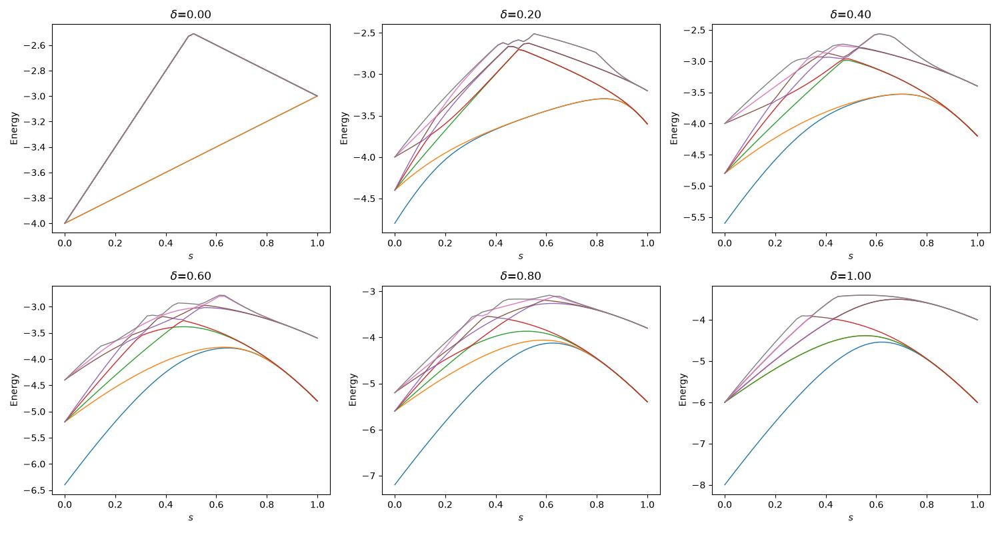
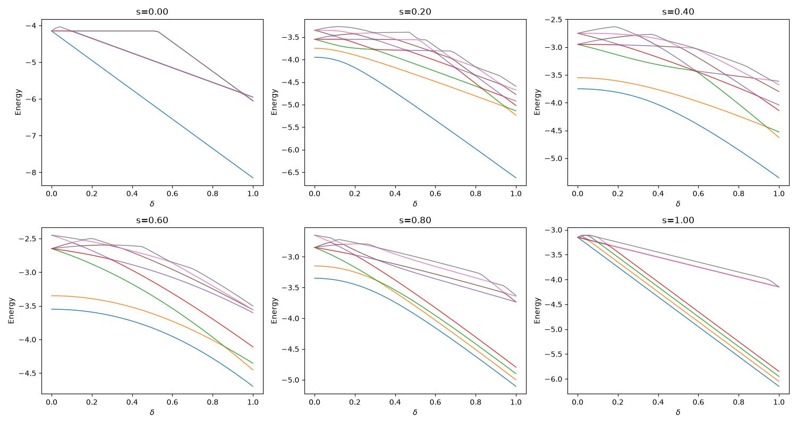

# README

这里的任务是：**为力学量加上守恒量约束，以打开基态能级简并**. 这样做的原因是在非简并的情况下(s=0)基态有确定的对称性，保证演化起点有这种对称性有利于对称性对绝热演化的保护.

顺便的，我们讨论了每一个拓扑相分区特殊区域的基态在量子电路上的直接制备.

## 分析对称性

> 下文将 <XX + YY> 取最低的态记为 "能量最低Bell state"

### 找到对称性算符

打开简并的一般性方法是向系统力学量加入对易力学量(最好的情况是构造CSCO). 也即：我们需要找到对称性算符，使得

$$
[P, H(t)] = 0
$$

如果我们的目标是区分四个态，对称性算符的本征值在这里应该是4；考虑到量子计算中一般偏向泡利基这种 Hermite 结构，对于一般的由 pauli bases 直接构成的 U 算符应该有：

$$
UU^\dagger = U^2 = I
$$

也就是正常来说应该最自然的是两个本征值；但是我们可以通过对两个 **对易厄米** U 线性组合构造 P, 例如：

$$
P = U_1 + 2U_2
$$

此时 P 的本征值为 $3, -1, 1, -3$ ; 再次重复，这里**不代表着能量简并态一定可以被非简并的打开为这四个对称性**，而是可以在这四个对称性之中选择。

按照上面的准则去找 pauli bases U, 可以看出来至少有三个：

$$
\begin{cases}
U_1 = \bigotimes_{i=1}^N X_i\\
U_2 = \bigotimes_{i=1}^N Y_i\\
U_3 = \bigotimes_{i=1}^N Z_i\\
\end{cases},
$$

此时有

$$
\begin{cases}
[U_i, H(t)] = 0\\
[U_i, U_j] = 0\\
\end{cases},
$$

但是这里面应该有一个是多余的，$U_y$ 的本征态一定可以被 $U_1, U_2$ 标记，或者说

$$
(-i)^NU_y = U_x U_z,
$$

总之暂且选择对称性算符:

$$
\begin{cases}
U_x = \bigotimes_{i=1}^N X_i\\
U_z = \bigotimes_{i=1}^N Z_i\\
\end{cases},
$$

此时可以构造 P

$$
P = U_x + 2U_z
$$

> **注意：$N$ 必须为4的倍数。

### 初态选择

**初始态的首要目标是方便制备，其次是尽量避免简并，再不然是可以从简并空间中挑出目标态.**

已知哈密顿量:

$$
H = (1-s) \sum_{i\text{ odd}} (X_i X_{i+1} + \delta Z_i Z_{i+1}) + s \sum_{j\text{ even}} (X_j X_{j+1} + \delta Z_j Z_{j+1})
$$

将 $Z_R = 1, -1, 0$ 分别视作相1, 2, 3.

#### 相 -1

##### 参数选择

方便制备位置很显然 $s = 1, \delta \neq 0$, 此时对于基态，有:

$$
\min{\sum_{i\text{ even}}} X_i X_{i+1} + \delta Z_i Z_{i+1}
$$

由于此哈密顿量所有项全部对易，基态时必然有：

$$
X_iX_{i+1} = Z_iZ_{i+1} = -1 \quad i \in 2N^+ - 1
$$

也即对于非边缘位置，基态为最低能量的 Bell bases product.

##### 简并性解决

对于非边缘位置，

$$
IXX...I = \bigotimes_{i \text{ odd}} X_iX_{i+1}
$$

**在总比特数为 $4N^+$ 时，上式恒为 $-1$**.

不妨设此时全局守恒量(实际上我们已经计算了确实是这个)为:

$$
\bigotimes_i X_i = \bigotimes_i Z_i = 1
$$

必然导致边缘:

$$
\begin{cases}
XII...X = -1\\
ZII...Z = -1\\
\end{cases}
$$

**也即在此点守恒量束缚退化成了边界条件的束缚**

所以结论：边缘态也是能量最低的Bell state，以8比特为例, 对应量子态：

```text
(|01⟩ - |10⟩)^{⊗ N/2}
     ┌───┐┌───┐          
q_0: ┤ X ├┤ H ├───────■──
     ├───┤├───┤       │  
q_1: ┤ X ├┤ H ├──■────┼──
     ├───┤└───┘┌─┴─┐  │  
q_2: ┤ X ├─────┤ X ├──┼──
     ├───┤┌───┐└───┘  │  
q_3: ┤ X ├┤ H ├──■────┼──
     ├───┤└───┘┌─┴─┐  │  
q_4: ┤ X ├─────┤ X ├──┼──
     ├───┤┌───┐└───┘  │  
q_5: ┤ X ├┤ H ├──■────┼──
     ├───┤└───┘┌─┴─┐  │  
q_6: ┤ X ├─────┤ X ├──┼──
     ├───┤     └───┘┌─┴─┐
q_7: ┤ X ├──────────┤ X ├
     └───┘          └───┘
```

#### 相 1

##### 参数选择

方便制备位置很显然 $s = 0, \delta \neq 0$, 此时对于基态，有:

$$
\min{\sum_{i\text{ odd}}} X_i X_{i+1} + \delta Z_i Z_{i+1}
$$

显然同相一，而且没有边缘简并.

此外这里直接可以看出**非简并基态对称性(也是全局基态对称性)取值**：

$$
\begin{cases}
X_i X_{i+1} = -1 \\
Z_i Z_{i+1} = -1 \\
\end{cases} \quad i \in 2N^+ - 1
$$

由于总比特数为 $4N^+$, 必然有：

$$
U_x = U_z = 1
$$

对于8比特电路，参考：

```text
(|01⟩ - |10⟩)^{⊗ N/2}
     ┌───┐┌───┐     
q_0: ┤ X ├┤ H ├──■──
     ├───┤└───┘┌─┴─┐
q_1: ┤ X ├─────┤ X ├
     ├───┤┌───┐└───┘
q_2: ┤ X ├┤ H ├──■──
     ├───┤└───┘┌─┴─┐
q_3: ┤ X ├─────┤ X ├
     ├───┤┌───┐└───┘
q_4: ┤ X ├┤ H ├──■──
     ├───┤└───┘┌─┴─┐
q_5: ┤ X ├─────┤ X ├
     ├───┤┌───┐└───┘
q_6: ┤ X ├┤ H ├──■──
     ├───┤└───┘┌─┴─┐
q_7: ┤ X ├─────┤ X ├
     └───┘     └───┘
```

#### 相 0

##### 参数选择

尝试从 $δ = 0, s \neq 0, 1$ 出发，有:

$$
H = (1 - s) \sum_{i\text{ odd}} X_i X_{i+1} + s \sum_{j\text{ even}} X_j X_{j+1}
$$

有意思的是，这里所有项相互对易. 基态时必然有:

$$
X_iX_{i+1} = -1 \quad i \in [1, N-1]
$$

观察能谱，此时为二重简并. 双比特空间 $XX$ 本身就只有二重简并，说明基态简并在确定一个位置自旋后已经可以区分。

比如 $X_1=1$ 时必然有 $X_2=-1$, 以此类推可确定全链。

也即基态空间有:

$$
\begin{cases}
|\phi^+\rangle = |+-+-...\rangle\\
|\phi^-\rangle = |-+-+...\rangle
\end{cases}
$$

##### 简并性解决

此时 $U_x$ 对这两个简并态没有区分作用：

$$
U_x |\phi^\pm\rangle = (-1)^{N/2} |\phi^\pm \rangle = |\phi^\pm\rangle
$$

于是需要提取的分量为 $U_z$ 的某个本征态。能量简并空间对 $U_z$ 对角化，有：

$$
Uz^{\phi^\pm} = \begin{Bmatrix}
0 && 1\\
1 && 0
\end{Bmatrix} \rightarrow
|\psi^\pm\rangle = \frac{1}{\sqrt 2} (|\phi^+\rangle \pm |\phi^-\rangle)
$$

注意其中 $Z|\pm\rangle = |\mp\rangle$.

对于 $U_z = 1$ 的对称性，其基态为:

$$
\frac{1}{\sqrt 2} (|\phi^+\rangle + |\phi^-\rangle)
$$

这是一个 X表象下的 GHZ 态, 八比特参考：

```text
|+-+-+-+-⟩ + |-+-+-+-+⟩
     ┌───┐     ┌───┐                                   
q_0: ┤ H ├──■──┤ H ├───────────────────────────────────
     └───┘┌─┴─┐└───┘┌───┐┌───┐                         
q_1: ─────┤ X ├──■──┤ X ├┤ H ├─────────────────────────
          └───┘┌─┴─┐└───┘├───┤                         
q_2: ──────────┤ X ├──■──┤ H ├─────────────────────────
               └───┘┌─┴─┐└───┘┌───┐┌───┐               
q_3: ───────────────┤ X ├──■──┤ X ├┤ H ├───────────────
                    └───┘┌─┴─┐└───┘├───┤               
q_4: ────────────────────┤ X ├──■──┤ H ├───────────────
                         └───┘┌─┴─┐└───┘┌───┐┌───┐     
q_5: ─────────────────────────┤ X ├──■──┤ X ├┤ H ├─────
                              └───┘┌─┴─┐└───┘├───┤     
q_6: ──────────────────────────────┤ X ├──■──┤ H ├─────
                                   └───┘┌─┴─┐├───┤┌───┐
q_7: ───────────────────────────────────┤ X ├┤ X ├┤ H ├
                                        └───┘└───┘└───┘
```

## 实验内容

构造**对称性约束哈密顿量**：

$$
H_c = (1-s) \sum_{i\text{ odd}} (X_i X_{i+1} + \delta Z_i Z_{i+1}) + s \sum_{j\text{ even}} (X_j X_{j+1} + \delta Z_j Z_{j+1}) - ϵP
$$

这里 $\epsilon$ 不要取很大(目前是0.05)，因为可能同对称性的能级直接跑到最下面; 其中

$$
P = U_x + 2U_z
$$

此时满足对称性的基态如果顺利的话可以被完全打开简并(至少目标基态要分离出来）. 为原本基态能量- 3ϵ.

## 实验结果

以8比特为例, 可以看到ZR并无变化，说明基态本身没有改变，只有能谱产生分列，简并打开.

### ZR 相图对比

**无约束（`phase_diagram`）** | **有约束（`symmetry_analysis`）**
:---:|:---:
 | 

### 能谱对比

设绘制最低能级数量为k, 则有:

**k = 4（s 扫描）** | **k = 4（δ 扫描）**
:---: | :---:
 | 
 | 

**k = 8（s 扫描）** | **k = 8（δ 扫描）**
:---: | :---:
 | 
 | 
